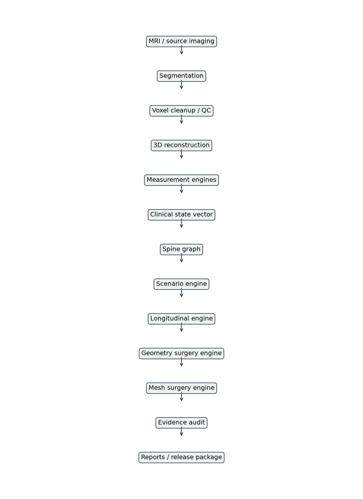
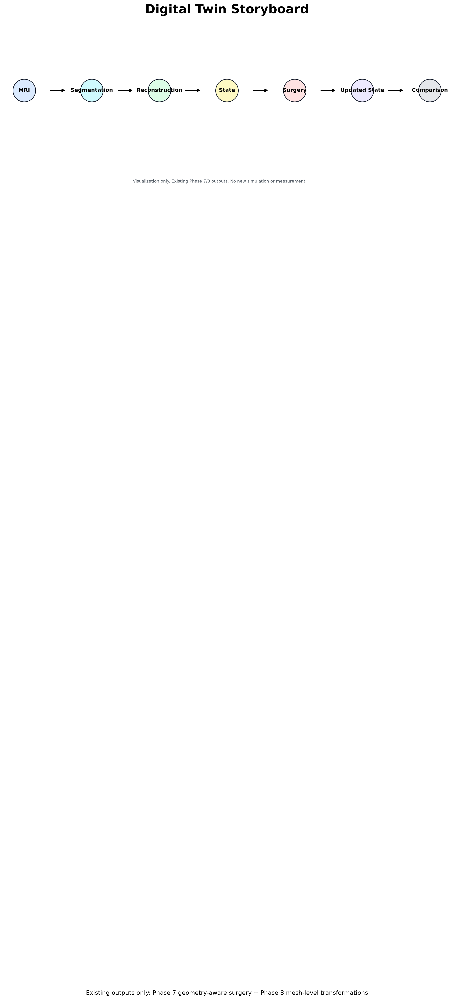

# OrthoTwin


**Patient-Specific Spine Digital Twin Prototype**

**MRI -> Segmentation -> Reconstruction -> State -> Simulation**

OrthoTwin is a research prototype that explores what happens after medical image segmentation: reconstruction, anatomical measurements, patient state representation, graph modeling, deterministic intervention simulation, and mesh-level anatomical transformation.

It is not a medical device, not a diagnostic system, and not a treatment recommendation tool.

---

## Visual Overview



**System architecture:** MRI-derived anatomy is organized into reconstruction, measurements, state, graph, simulation, mesh transformation, and analysis layers.


**Patient Alpha showcase:** reconstructed spine structures with labels, coordinate axes, and centerline-style organization.



**Digital twin story:** a compact view of the workflow from imaging artifacts to updated state and comparison.


**Surgery comparison:** existing intervention outputs compared by affected structures, geometry changes, state changes, graph changes, and displacement magnitude.

---

## Overview

Most medical imaging projects stop at segmentation. OrthoTwin explores the next question:

> Once anatomy has been segmented, how can it become a connected digital twin representation?

The project builds a prototype architecture around:

- 3D spine reconstruction
- quantitative anatomical measurements
- patient and clinical state vectors
- graph-based spine relationships
- deterministic intervention scenarios
- geometry-aware surgery demonstrations
- mesh-level transformation outputs
- evidence and limitation audits

The goal is not to claim clinical validity. The goal is to demonstrate a serious engineering framework for future computational medicine research.

---

## Pipeline

```text
MRI
  |
  v
Segmentation
  |
  v
3D Reconstruction
  |
  v
Measurements
  |
  v
Patient State
  |
  v
Spine Graph
  |
  v
Simulation
  |
  v
Mesh Transformation
  |
  v
Analysis
```

---

## Project Results

Repository-derived V1.0 values:

| Result | Value |
|---|---:|
| Archived MRI scans/cases represented by raw MHA files | 447 |
| Reconstructed structures | 14 |
| Vertebrae | 8 |
| Discs | 6 |
| Mesh vertices | 75,312 |
| Mesh faces | 147,636 |
| Intervention scenarios | 10 |
| Simulation output files | 53 |
| Curated showcase figures | 44 |
| PPT-ready assets | 26 |
| Classification | Digital Twin Prototype V1.0 |

The large raw dataset is archived locally under `archive/internal/` and is excluded from the public GitHub repository.

---

## What Can OrthoTwin Produce From an MRI?

Input:

```text
MRI scan / segmentation-derived anatomy
```

Outputs:

- Segmented anatomy
- Reconstructed spine
- Geometry-derived measurements
- Patient state vector
- Clinical state vector
- Mesh state vector
- Spine graph
- Intervention scenarios
- Geometry-aware surgery outputs
- Mesh-level surgery transformation visualizations
- Evidence and limitation reports


**Implant-style demonstration:** before/after visualization generated from existing mesh-level outputs.


**Mesh displacement:** color-coded mesh transformation visualization from existing Phase 8 output.

---

## Architecture

| Subsystem | Purpose |
|---|---|
| Segmentation | Produces anatomy masks and segmentation-derived artifacts. |
| Reconstruction | Converts structures into 3D mesh representations. |
| Measurements | Computes geometry-derived and estimated anatomical features. |
| State | Stores patient, clinical, graph, surgery, and mesh state files. |
| Graph | Connects vertebrae and discs as a structured spine system. |
| Simulation | Runs deterministic intervention and scenario comparisons. |
| Mesh | Applies vertex-level anatomical transformations for demonstration. |
| Visualization | Generates dashboards, showcase figures, and audit graphics. |
| Evidence | Separates real, derived, estimated, rule-derived, and blocked components. |

---

## Showcase Gallery

| Figure | Description |
|---|---|
| `patient_alpha_showcase.png` | Hero baseline view of Patient Alpha. |
| `digital_twin_story.png` | End-to-end digital twin workflow. |
| `reconstruction_gallery.png` | 3D reconstruction views. |
| `measurement_dashboard.png` | Anatomical measurement dashboard. |
| `spine_graph_presentation.png` | Graph representation of the spine. |
| `surgery_comparison_dashboard.png` | Intervention comparison dashboard. |
| `mesh_displacement_heatmap_implant.png` | Mesh-level displacement visualization. |
| `calibration_decision_flowchart.png` | Physical calibration decision pathway. |

See the curated showcase folder:

```text
showcase/
```

---

## Why This Project Matters

OrthoTwin is interesting because it investigates the engineering layer between segmentation and real digital twin research.

Many projects demonstrate AI segmentation. Fewer projects ask how segmentation outputs can become:

- structured anatomy,
- measurable geometry,
- connected graph state,
- intervention-ready state transitions,
- mesh-level transformation systems,
- and auditable research artifacts.

OrthoTwin is a prototype framework for that transition.

---

## Scientific Limitations

These limitations are central to the project:

- **Physical calibration blocked:** trusted Patient Alpha spacing/orientation metadata could not be linked to the active reconstruction pipeline.
- **No clinical validation:** no independent radiologist or clinical validation is present.
- **No biomechanical validation:** mesh transformations are geometric demonstrations, not validated biomechanics.
- **Not a medical device:** OrthoTwin is not intended for clinical use.
- **Not for diagnosis:** the system does not diagnose disease.
- **No treatment recommendation:** intervention outputs are deterministic prototype demonstrations.
- **No outcome prediction claims:** the system does not predict clinical outcomes.

The calibration audit concluded:

```text
Decision: calibration still blocked
Confidence: LOW
Calibrated measurements generated: False
```

---

## Repository Layout

```text
OrthoTwin/
|-- config/              # Default configuration
|-- data/                # Minimal public metadata/example files
|-- docs/                # Architecture, roadmap, whitepaper, limitations
|-- manifests/           # Project dataflow and phase manifests
|-- measurements/        # Geometry and measurement outputs
|-- models/              # Retained final/showcase checkpoints
|-- presentation/        # Storyboard and demo scripts
|-- reports/             # Technical audits and release reports
|-- showcase/            # Curated GitHub/demo/PPT-ready assets
|-- simulation/          # Prototype engines and transformation modules
|-- state/               # Patient, graph, surgery, mesh, and future states
|-- tools/               # Audit and packaging utilities
|-- visualization/       # Generated visual assets
|-- archive/internal/    # Local-only recovery archive, excluded from GitHub
```

---

## Installation

```bash
git clone <your-repository-url>
cd OrthoTwin
python -m venv .venv
.venv\Scripts\activate
pip install -r OrthoTwin/requirements.txt
```

Lightweight checks:

```bash
python -m compileall -q OrthoTwin
python OrthoTwin/tools/github_inclusion_audit.py
```

The public showcase does not require the archived 33 GB raw DICOM dataset.

---

## Example Workflow

```bash
python OrthoTwin/tools/generate_showcase_edition.py
python OrthoTwin/tools/generate_simulation_visualization_suite.py
python OrthoTwin/tools/generate_master_technical_audit.py
```

These commands regenerate showcase and audit layers from existing outputs. They do not train models, rerun segmentation, or create new scientific measurements.

---

## Research Contributions

OrthoTwin V1.0 contributes:

- a prototype MRI-to-digital-twin architecture,
- a connected patient state representation,
- a graph model for vertebra-disc relationships,
- a geometry-aware intervention layer,
- a mesh-level transformation demonstration,
- a scientific evidence and limitation audit,
- and a curated open-source showcase package.

This is a research exploration and engineering system, not a clinical validation study.

---

## Roadmap

Short term:

- recover trusted physical calibration,
- validate measurements against expert references,
- improve reproducible setup and documentation.

Medium term:

- prepare FEM-compatible mesh workflows,
- introduce real material properties and boundary conditions,
- validate graph/state changes across more cases.

Long term:

- longitudinal validation,
- clinical collaboration,
- prospective validation,
- outcome-linked research datasets.

---

## Citation

```bibtex
@software{orthotwin_v1,
  title = {OrthoTwin: Patient-Specific Spine Digital Twin Prototype},
  version = {1.0},
  year = {2026},
  note = {Research prototype; not clinically validated}
}
```

---

## Final Message

OrthoTwin is a research prototype exploring how MRI-derived anatomy can be transformed into a connected digital twin architecture for reconstruction, state modeling, intervention simulation, and future computational medicine research.
