# OrthoTwin V1.0 Master Technical Audit

Generated: 2026-06-21T11:59:35.280873+00:00

Audience: professors, researchers, engineers, judges, and future collaborators.

Scientific boundary: this document uses existing repository outputs only. It creates no new science, no new measurements, and no new simulations.

---

## Section 1. Executive Summary

OrthoTwin is a research prototype for converting segmentation-derived spine anatomy into a connected, inspectable digital twin representation. It began as an imaging and segmentation project and evolved into a broader architecture for state representation, graph modeling, scenario comparison, geometry-aware surgery, mesh-level transformation, and evidence auditing.

The project was built to solve a common problem in medical-imaging research: segmentation masks and measurements are often useful but disconnected. OrthoTwin organizes those artifacts into a system where anatomy, measurements, relationships, interventions, mesh transformations, limitations, and evidence can be inspected together.

What was achieved is substantial from an engineering perspective. The repository now includes segmentation-derived artifacts, 3D reconstruction outputs, clinical-style state vectors, a spine graph, deterministic scenario outputs, longitudinal projections, geometry-aware surgery outputs, mesh-level transformation outputs, visualization packages, and release-level documentation. The current repository audit counted 148946 files, 65 report-like artifacts, 71 state files, 103 measurement-related files, 104 visualization artifacts, and 53 simulation output files.

The most important unresolved issue is physical calibration. Phase 9 reports `PHYSICAL CALIBRATION BLOCKED` with confidence `NONE`. Therefore, voxel-space measurements must not be treated as validated physical millimeter measurements. The project is also missing independent radiologist validation, biomechanics, finite element modeling, longitudinal clinical validation, outcome prediction, and regulatory validation.

Final classification: **Digital Twin Prototype**.


---

## Section 2. Project Evolution

The initial ambition was:

```text
MRI -> Segmentation -> World Model -> Surgery Prediction
```

That ambition evolved because each layer exposed a missing prerequisite. Segmentation alone produced masks, but a digital twin requires anatomy, relationships, state, evidence, and controlled transformations. The project therefore moved through the following phases:

| Phase | Focus | Why It Was Added |
|---|---|---|
| Phase 1 | Segmentation | Establish anatomy extraction from MRI-derived data. |
| Phase 2 | State Representation | Convert disconnected files into a structured patient state. |
| Phase 3 | Graph Modeling | Make the spine behave like a connected system. |
| Phase 4 | Measurement Engine | Extract geometry-derived and clinical-style measurements. |
| Phase 5 | Scenario Engine | Compare deterministic future states against baseline. |
| Phase 6 | Evidence Framework | Separate real, derived, estimated, unsupported, and unknown elements. |
| Phase 7 | Geometry-Aware Surgery | Move from metric edits toward anatomy-first transformations. |
| Phase 8 | Mesh-Level Digital Twin | Move from centroid abstractions to vertex-level mesh transformations. |
| Phase 9 | Scientific Grounding Audit | Identify what is scientifically supported and what is blocked. |
| V1 Release | Freeze and Packaging | Make the project explainable, auditable, and demonstrable. |

The evolution is important: OrthoTwin did not become a clinical predictor. It became a technical prototype that makes the requirements for a future research-grade digital twin visible.


---

## Section 3. Dataset and Inputs

The active case is Patient Alpha. Available artifacts include MRI-related files, segmentation outputs, masks, reconstructed structures, measurement JSON files, state vectors, graph files, simulation outputs, reports, and visualizations.

The repository contains a large imaging footprint, including `.mha`, `.nii.gz`, and `.dcm` files reported by the Phase 9 spacing audit. However, the active Patient Alpha state and reconstructed structures could not be physically calibrated from a provably linked source image header. This is the key dataset limitation.

Known input formats include:

- MHA image files.
- NIfTI-style files.
- DICOM files.
- NumPy arrays.
- Pickled reconstructed mesh structures.
- JSON measurement, state, graph, simulation, and report outputs.

Known limitations:

- Patient Alpha physical spacing is not proven.
- Orientation and slice thickness are not proven for the active state.
- Segmentation-derived geometry depends on earlier masks and preprocessing.
- Clinical ground truth is absent.

---

## Section 4. Segmentation System

The repository includes segmentation-derived outputs and earlier SegResNet-related artifacts. The V1 audit does not retrain models and does not rerun inference. Segmentation is treated as an existing input layer for the later digital twin architecture.

The segmentation pipeline includes model training artifacts, validation artifacts, prediction masks, cleaned segmentation outputs, and visualization figures. The available segmentation figures show MRI slices, overlays, predicted/cleaned masks, and label-related visual summaries.

The cleanup pipeline included connected-component filtering and voxel cleanup in prior stages. Those outputs support later reconstruction and measurement steps.

Limitations:

- No independent clinical segmentation validation is documented.
- Dice scores and training details are repository artifacts rather than a prospective validation study.
- Any downstream measurement inherits segmentation uncertainty.

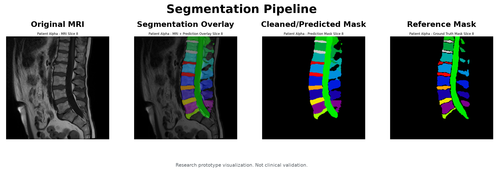

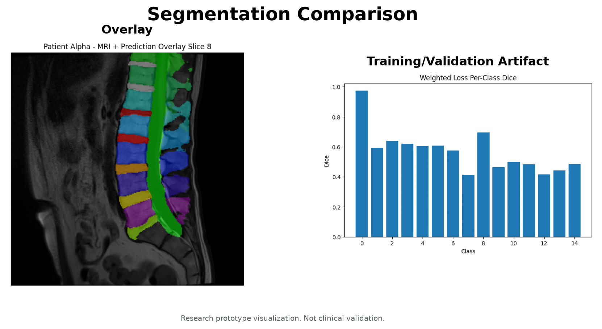

---

## Section 5. 3D Reconstruction

The reconstruction layer converts segmentation-derived structures into mesh representations. Phase 8 inventory reports 14 mesh structures: 8 vertebrae and 6 discs. The mesh inventory contains 75312 vertices and 147636 faces.

For every structure, the mesh state stores centroids, PCA axes, PCA lengths, bounding boxes, volume estimates, and surface area estimates. These are geometry-derived and voxel-space unless calibration is recovered.

PCA methodology is used to describe local shape axes and dimensions. Centerline extraction uses vertebral centroids as a spine-level geometry proxy.

Limitations:

- The meshes are segmentation-derived.
- Mesh geometry is in voxel coordinate space.
- Volume and surface area are geometry estimates, not clinically validated measurements.

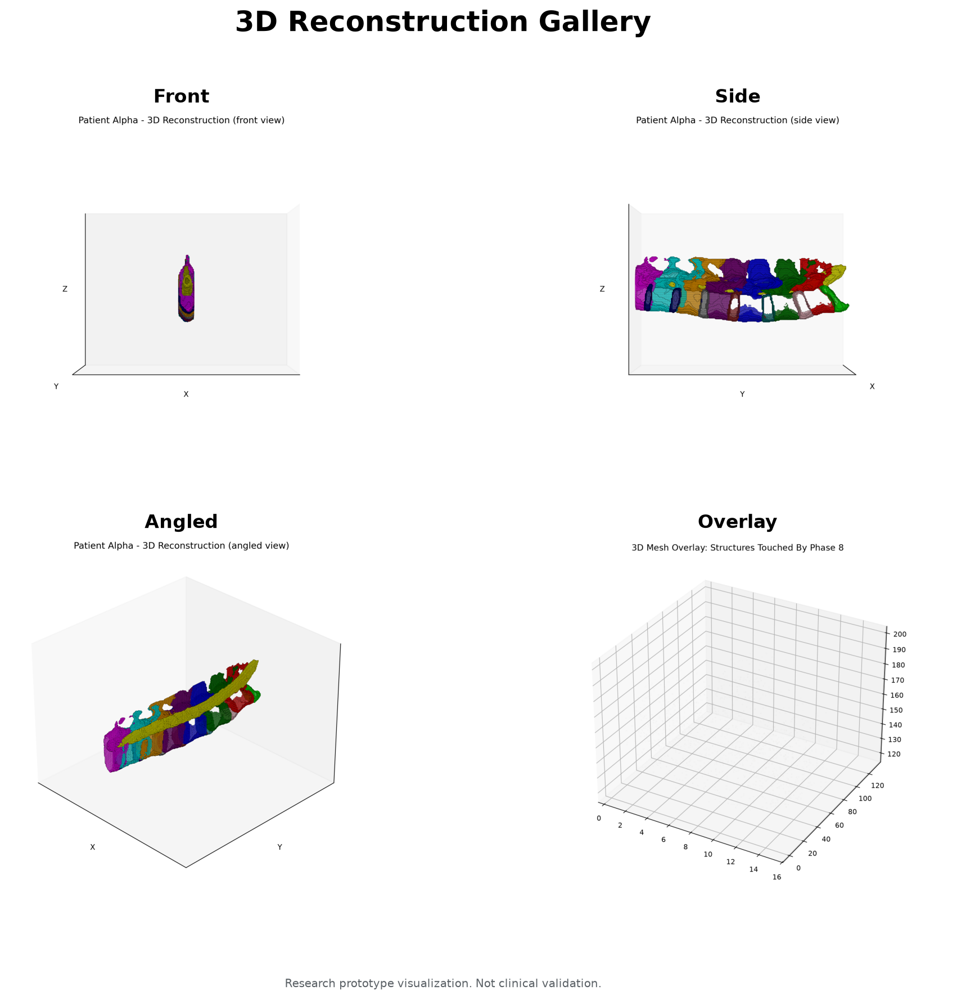


---

## Section 6. Measurement Engine

The measurement engine generates disc heights, disc areas, canal estimates, foraminal estimates, slippage-style displacement, curvature, alignment, PCA dimensions, centroids, bounding boxes, and degeneration-style internal scores.

Evidence classification:

| Measurement Type | Status |
|---|---|
| Mesh centroids | Geometry derived |
| PCA lengths | Geometry derived |
| Bounding boxes | Geometry derived |
| Disc heights | Geometry derived |
| Disc areas | Geometry derived / estimated |
| Canal area | Estimated |
| Foraminal area | Estimated |
| Curvature | Geometry derived |
| Alignment | Geometry derived |
| Load metrics | Rule derived |
| Risk scores | Rule derived |
| Longitudinal progression | Assumption driven |

Calibration limitation: because physical spacing is blocked, voxel units cannot be converted into trusted physical units.

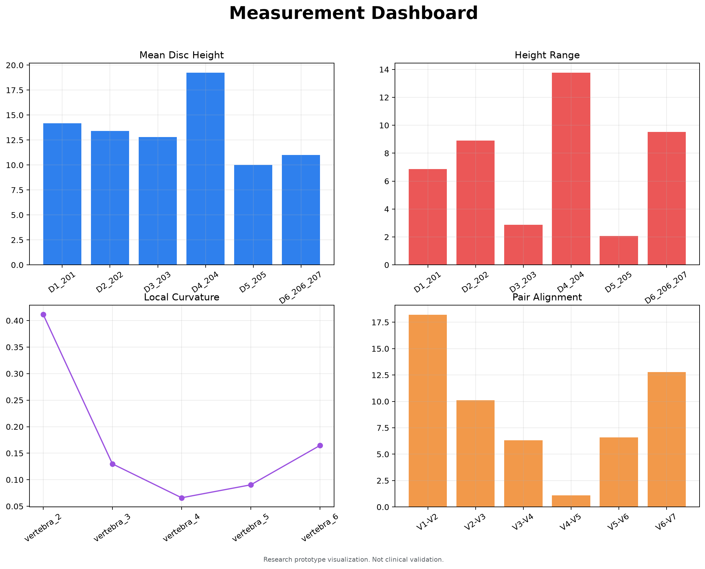

---

## Section 7. Digital Twin State Model

The state model is the core abstraction of OrthoTwin. It converts measurements and metadata into structured patient state files. The project contains patient state, clinical state, mesh state, graph state, surgery states, scenario states, and longitudinal future states.

State representation matters because it creates a stable interface between anatomy, measurement, graph relationships, interventions, comparison, and reporting. Without state representation, the project would remain a collection of disconnected measurement files.

The clinical state vector includes disc heights, disc areas, canal estimates, foraminal estimates, curvature, alignment, slippage-style displacement, degeneration features, and scope warnings. The mesh state vector adds vertices-derived metadata such as centroids, PCA axes, bounding boxes, surface area, and volume estimates.

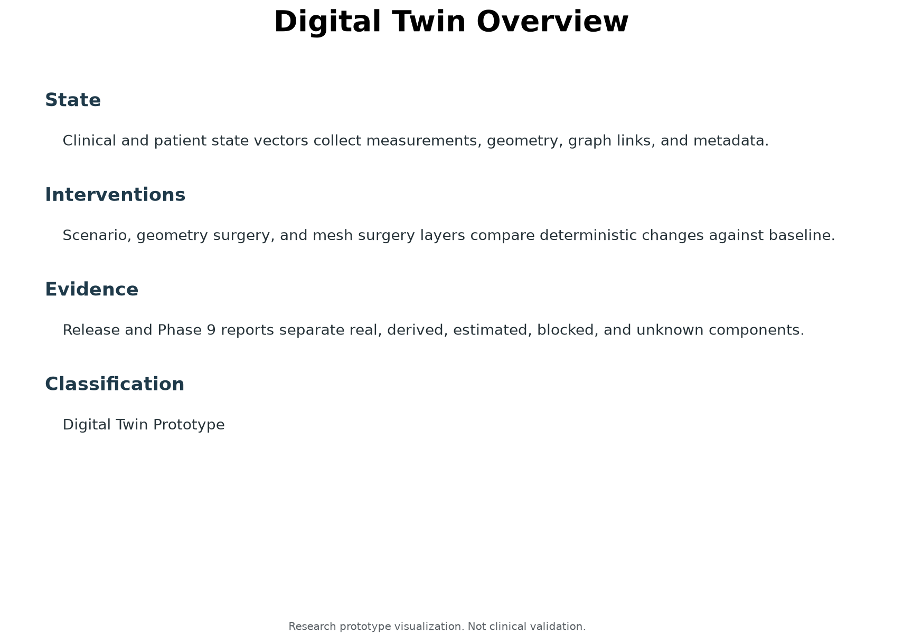

---

## Section 8. Spine Graph

The spine graph represents vertebrae and discs as connected nodes. Edges define disc-vertebra and vertebra-disc relationships. This graph enables the spine to be represented as a connected system rather than an independent set of measurements.

Graph outputs include nodes, edges, disc relationships, centerline outputs, relative metrics, load path estimates, and validation reports from earlier stages.

The load path model is explicitly not physics. It is a deterministic geometric approximation layer. It should be interpreted as a software mechanism for propagation-style demonstrations, not a biomechanical result.

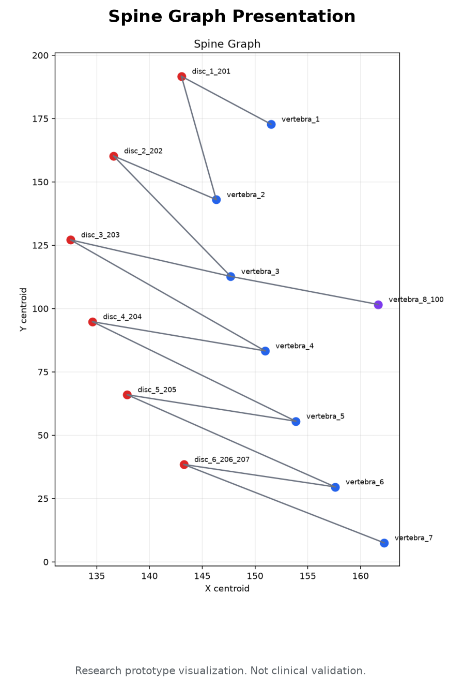

---

## Section 9. Simulation Framework

The simulation framework includes deterministic scenario comparison, future states, intervention framework, and state transition outputs. Its conceptual form is:

```text
Before State -> Action -> After State
```

The scenario engine compares baseline, collapse, restoration, fusion, and implant-style scenarios. The longitudinal engine creates projected future states from configurable assumptions. These systems support demonstration and internal comparison, not clinical prediction.

Limitations:

- No validated physical model.
- No clinical outcome data.
- No patient-specific temporal calibration.
- No treatment recommendation.

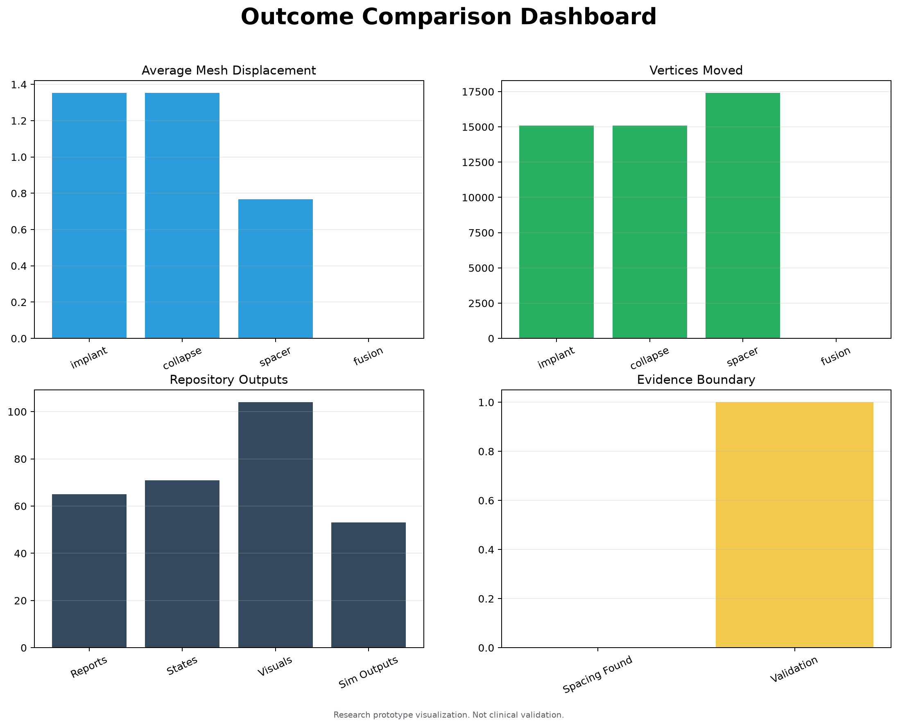

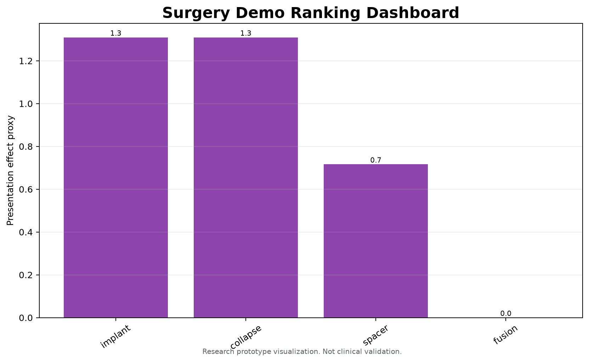

---

## Section 10. Geometry-Aware Surgery

Phase 7 introduced surgical objects and anatomy-aware modifications. Supported surgery demonstrations include implant insertion, spacer insertion, fusion, and alignment correction.

The Phase 7 forensic audit found that implant, spacer, and alignment correction are partially geometry-first because they modify disc height, centroids, or local geometry before rebuilding dependent state. Fusion is relationship/constraint-heavy: it creates a fusion relationship and lock but does not substantially modify mesh geometry.

This is a major architectural improvement over direct metric edits, but it is still not a validated surgical simulator.

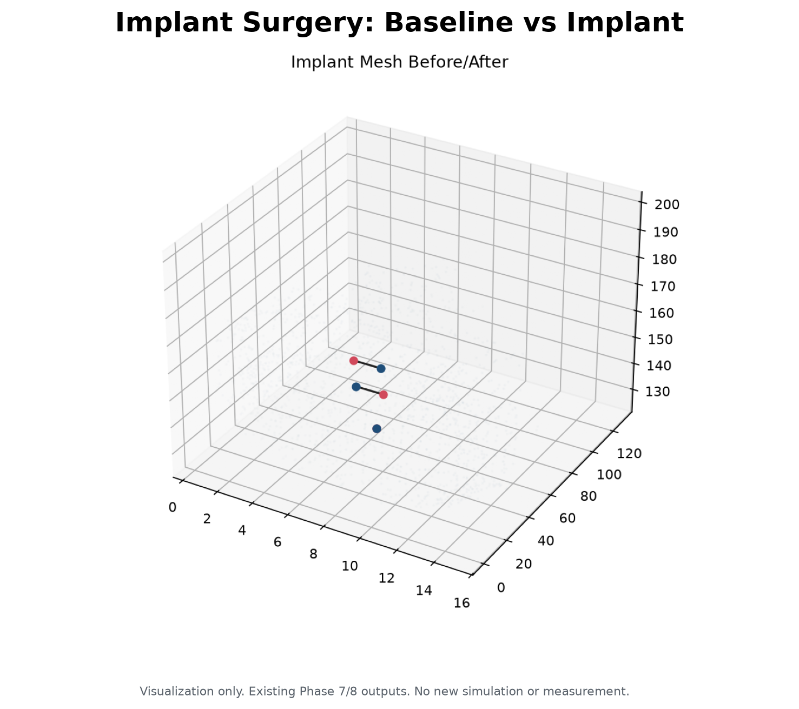

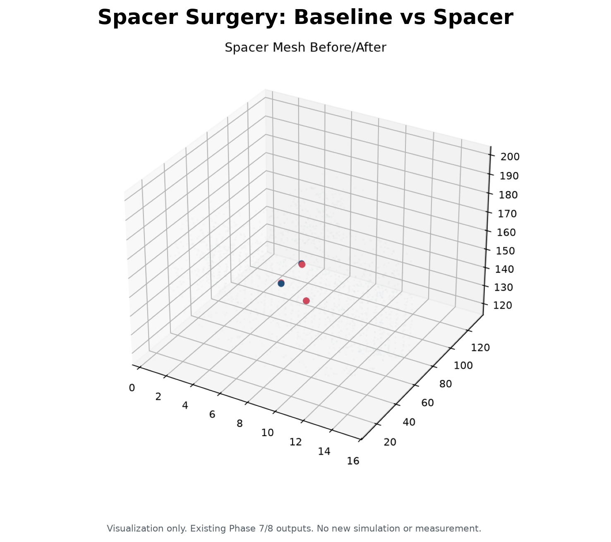

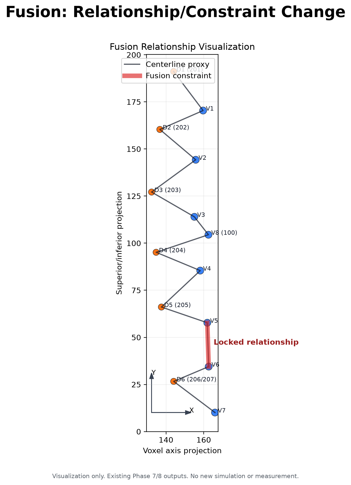

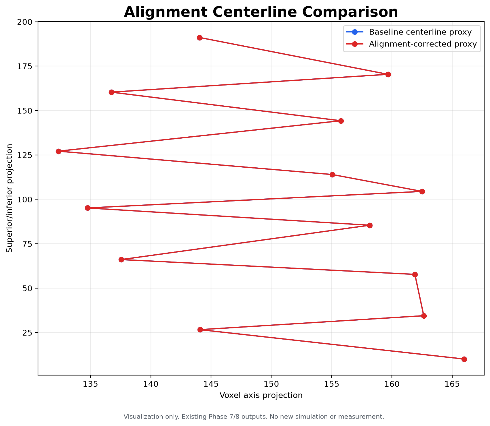

---

## Section 11. Mesh-Level Digital Twin

Phase 8 moved the architecture from centroid-level geometry toward mesh-level transformations. The mesh transformation engine supports vertex operations such as translation, rotation, scaling, disc height expansion, disc compression, and local alignment changes.

Existing Phase 8 mesh outputs include implant, collapse, spacer, and fusion. Implant, collapse, and spacer move vertices. Fusion preserves geometry and records a relationship/constraint change.

Mesh impact summary:

| Surgery | Interpretation |
|---|---|
| Implant | Vertex-level change around target disc and adjacent vertebrae. |
| Collapse | Vertex-level compression around target disc and adjacent vertebrae. |
| Spacer | Vertex-level local expansion around target disc and neighbors. |
| Fusion | Relationship/constraint change with geometry preserved. |

Limitations:

- Mesh transformation is geometric, not biomechanical.
- No material properties.
- No boundary conditions.
- No FEM solver.
- No clinical validation.

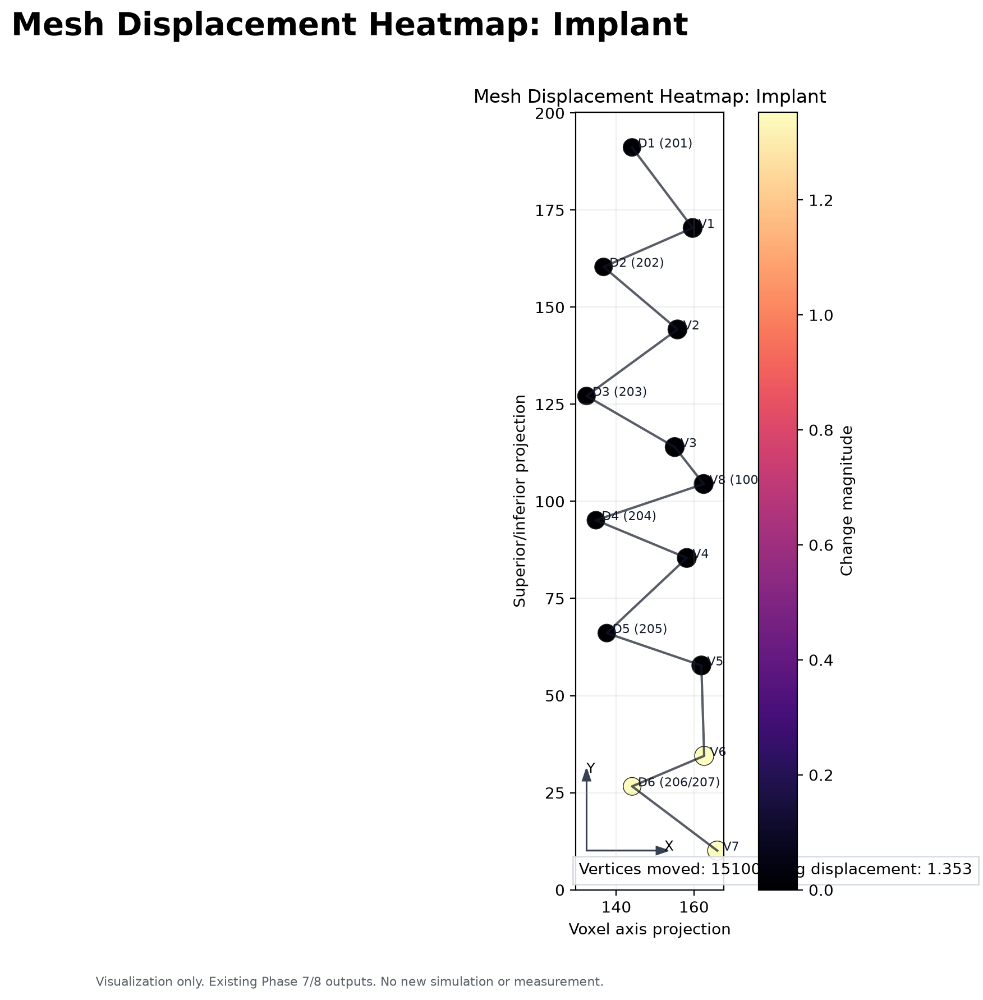


---

## Section 12. Results

The most significant technical result is integration. OrthoTwin now demonstrates a full path from segmentation-derived artifacts to reconstructed mesh, measurements, state, graph, scenarios, surgery, mesh-level transformations, evidence audit, and presentation-ready outputs.

Key repository-derived results:

| Result | Value |
|---|---:|
| Mesh structures | 14 |
| Vertebrae | 8 |
| Discs | 6 |
| Vertices | 75312 |
| Faces | 147636 |
| Reports | 65 |
| State files | 71 |
| Visualizations | 104 |
| Simulation outputs | 53 |


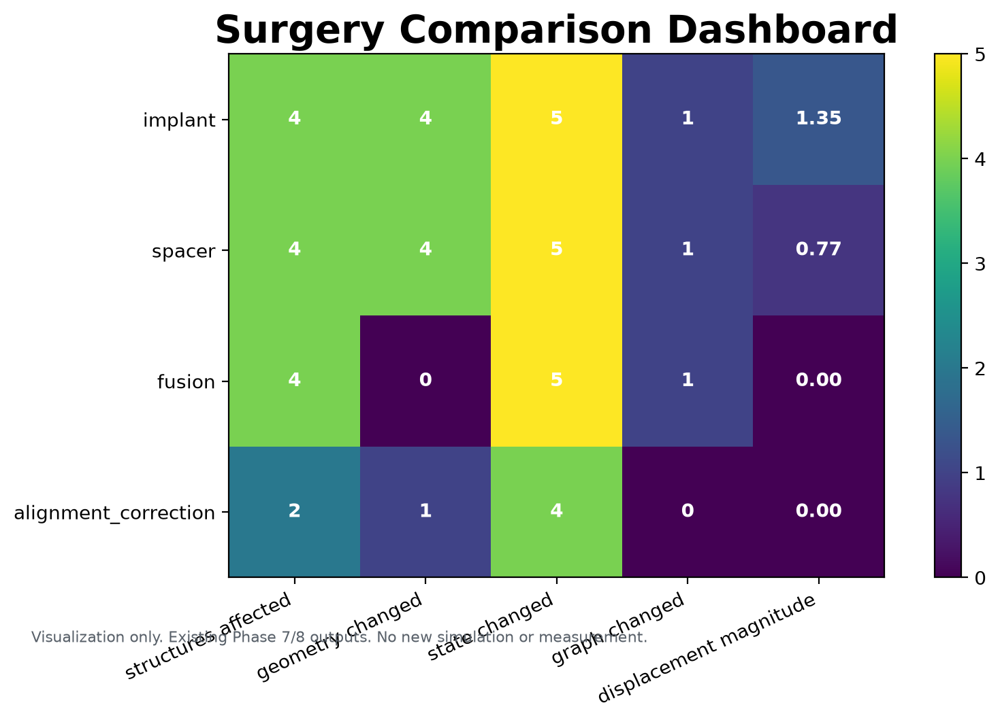

---

## Section 13. Evidence Audit

The evidence audit is one of the most important parts of the project because it prevents overclaiming.

Evidence categories:

- Real repository artifacts: files, masks, meshes, reports, generated states.
- Geometry derived: centroids, PCA dimensions, bounding boxes, disc heights, curvature proxies.
- Estimated: canal area, foraminal area, degeneration-style scores.
- Rule derived: load redistribution, risk scores, scenario ranking, longitudinal progression.
- Unsupported or blocked: physical calibration, clinical validation, biomechanics, outcome prediction.

Phase 9 concluded that physical calibration is blocked. This means physical units should not be claimed unless a provably linked source image/header is recovered.

---

## Section 14. Limitations

This section is deliberately blunt.

Missing:

- Physical calibration.
- Trusted voxel spacing for active Patient Alpha outputs.
- Independent radiologist validation.
- Biomechanical validation.
- FEM.
- Material models.
- Boundary conditions.
- Longitudinal validation.
- Outcome prediction.
- Clinical validation.
- Regulatory validation.

The system cannot be treated as a clinical tool. It is a research prototype and software architecture demonstration.

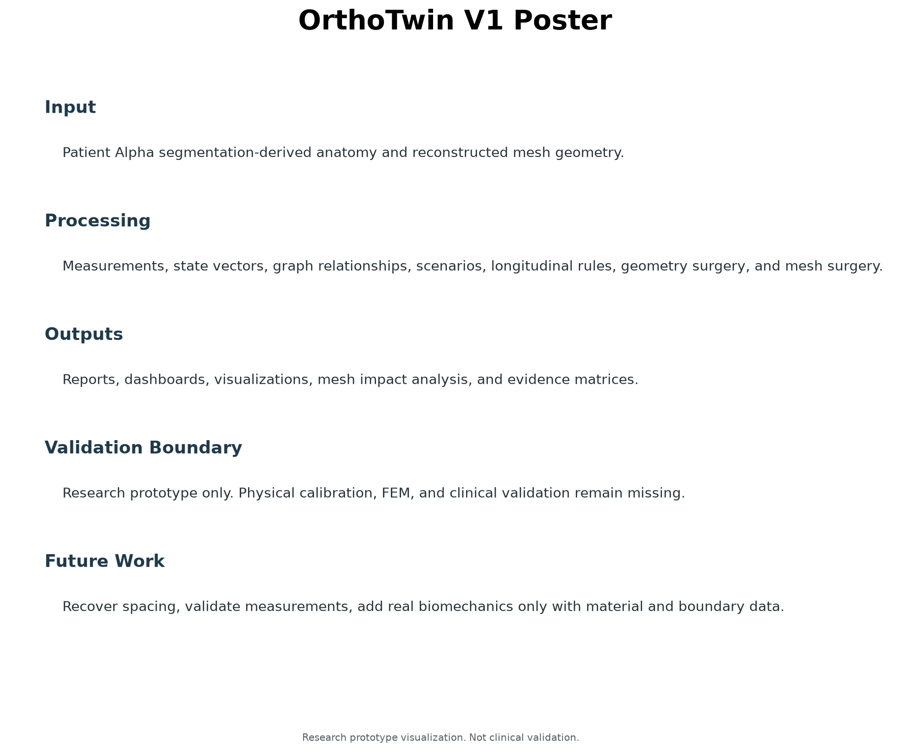

---

## Section 15. What OrthoTwin Can Do

Current capabilities:

- Organize segmentation-derived spine artifacts.
- Store reconstructed mesh structure metadata.
- Build patient, clinical, graph, scenario, surgery, and mesh states.
- Visualize segmentation, reconstruction, measurements, graph, surgery, mesh changes, and evidence boundaries.
- Run deterministic scenario comparisons from existing state.
- Demonstrate geometry-aware and mesh-level transformations.
- Generate release, evidence, and presentation reports.

Supported workflows:

- Patient Alpha state inspection.
- Mesh inventory and reconstruction review.
- Graph connectivity review.
- Scenario comparison.
- Surgery demonstration.
- Evidence and limitation review.

---

## Section 16. What OrthoTwin Cannot Do

OrthoTwin cannot:

- Diagnose disease.
- Recommend treatment.
- Predict clinical outcomes.
- Forecast validated progression.
- Claim physical millimeter accuracy without spacing.
- Claim biomechanical accuracy.
- Replace FEM.
- Replace radiologist measurement validation.
- Support regulatory or clinical deployment.

---

## Section 17. Scientific Assessment

Existing Phase 6 readiness score: `5.285714285714286`.

Assessment:

| Dimension | Status |
|---|---|
| Engineering maturity | Strong prototype architecture |
| Research maturity | Promising but requires external validation |
| Clinical maturity | Low; no clinical validation |
| Digital twin maturity | Prototype; connected state and mesh transformations exist |
| Repository maturity | Strong documentation and audit package |
| Biomechanics maturity | Blocked |
| Calibration maturity | Blocked |

The project is strongest as a transparent research software prototype. It is weakest where external evidence is required.

---

## Section 18. Future Work

Short term:

- Recover provably linked Patient Alpha spacing and orientation.
- Verify measurements against radiologist-reviewed references.
- Reduce copied or stale sections in rebuilt states.
- Add reproducible command-level run documentation.

Medium term:

- Build multi-patient validation dataset.
- Integrate real material properties and boundary conditions.
- Prepare FEM-compatible mesh pipeline.
- Validate graph and state changes against known cases.

Long term:

- Longitudinal validation.
- Prospective research study.
- Outcome-linked dataset.
- Regulatory planning only after clinical purpose and validation pathway are defined.

---

## Section 19. Repository Statistics

| Repository Metric | Count |
|---|---:|
| Total files | 148946 |
| Total repository bytes | 45851725179 |
| Reports | 65 |
| State files | 71 |
| Measurement-related files | 103 |
| Visualizations | 104 |
| Manifests | 25 |
| Simulation outputs | 53 |
| Mesh structures | 14 |
| Vertices | 75312 |
| Faces | 147636 |

Architecture artifacts include release documentation, architecture graph JSON, architecture diagram, whitepaper, roadmap, executive summary, presentation package, simulation visualization suite, and this master technical audit.

---

## Section 20. Final Verdict

OrthoTwin is a **Digital Twin Prototype**.

It successfully demonstrates:

- A complete repository-level architecture.
- Connected patient state representation.
- Spine graph modeling.
- Geometry-derived measurements.
- Deterministic scenario comparison.
- Geometry-aware surgery demonstrations.
- Mesh-level transformation demonstrations.
- Honest evidence and limitation reporting.

It is technically interesting because it moves beyond segmentation into a connected anatomy-state-graph-mesh architecture. It is not yet a clinical system because it lacks calibration, clinical validation, biomechanics, longitudinal validation, outcome validation, and regulatory evidence.

The correct final interpretation is:

```text
Research software prototype
not clinical software
not treatment planning
not validated biomechanics
```

---

## Referenced Outputs

The master audit references 20 copied assets in `orthotwin_master_audit_assets/`, plus repository outputs from release, phase, state, visualization, and evidence folders.
