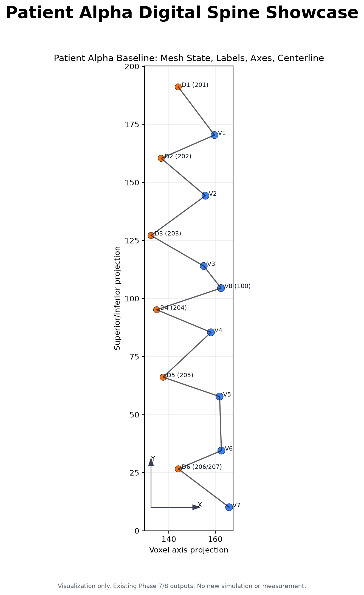
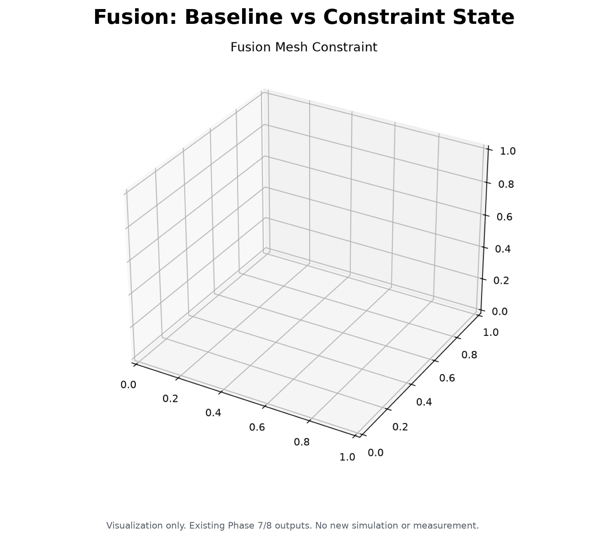
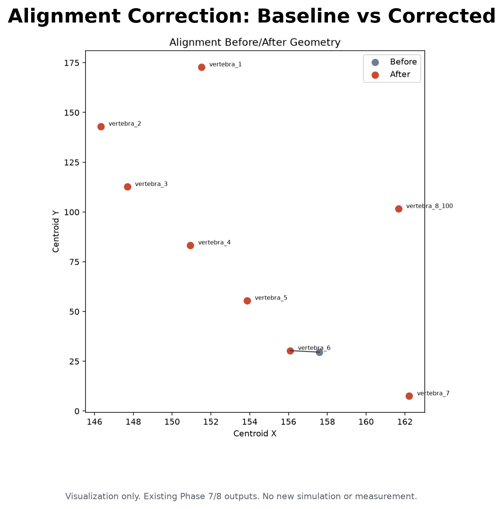
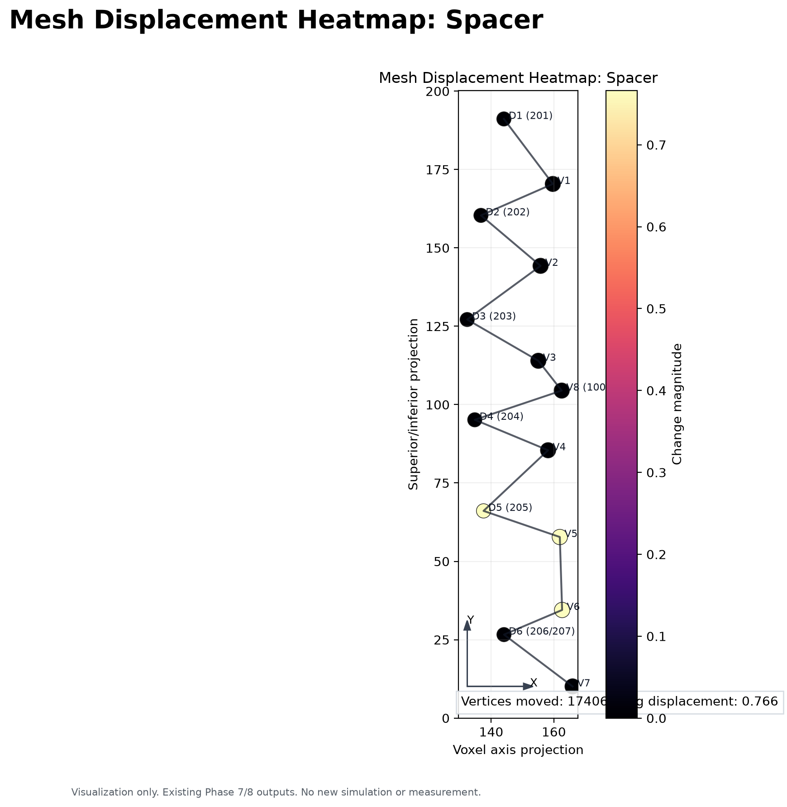
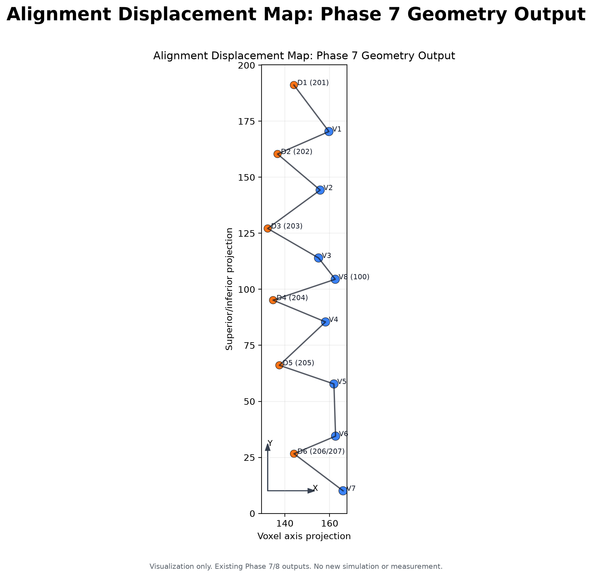
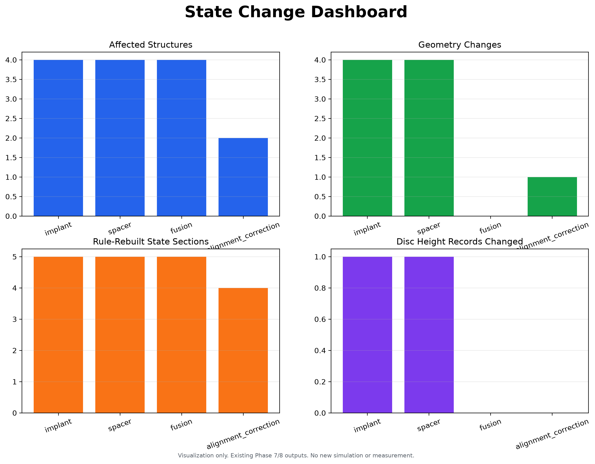
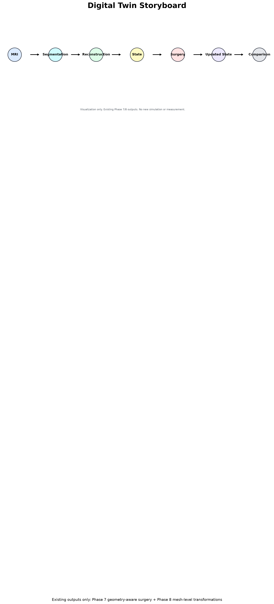

# OrthoTwin Simulation Showcase Gallery

## patient_alpha_showcase.png

Hero baseline view with mesh-state labels, coordinate axes, and centerline proxy.

## implant_before_after.png

Existing Phase 8 implant before/after mesh visualization.

## spacer_before_after.png

Existing Phase 8 spacer before/after mesh visualization.

## fusion_before_after.png

Existing Phase 8 fusion before/after constraint visualization.

## alignment_before_after.png

Existing Phase 7 alignment correction comparison.

## mesh_displacement_heatmap_implant.png

Mesh displacement magnitude presentation map for implant output.

## mesh_displacement_heatmap_spacer.png

Mesh displacement magnitude presentation map for spacer output.

## mesh_displacement_heatmap_alignment.png

Available Phase 7 alignment displacement map; not a Phase 8 mesh simulation.

## state_change_dashboard.png

State and rule-rebuild comparison across surgery outputs.

## surgery_comparison_dashboard.png

Rows/columns comparison of affected structures, geometry, state, graph, and displacement.

## digital_twin_story.png

One-slide digital twin workflow story.

